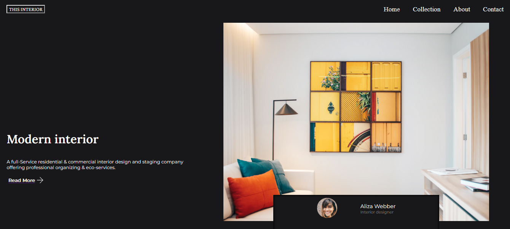

<!-- Please update value in the {}  -->

<h1 align="center">{Interior Consultant}</h1>

   Solution for a challenge from  <a href="http://devchallenges.io" target="_blank">Devchallenges.io</a>.

  <h3>
    <a href="https://{your-demo-link.your-domain}">
      Demo
    </a>
     | 
    <a href="https://{your-url-to-the-solution}">
      Solution
    </a>
     | 
    <a href="https://devchallenges.io/challenges/Jymh2b2FyebRTUljkNcb">
      Challenge
    </a>
  </h3>

<!-- TABLE OF CONTENTS -->

## Table of Contents

- [Table of Contents](#table-of-contents)
- [Overview](#overview)
  - [Built With](#built-with)
- [Features](#features)
- [Acknowledgements](#acknowledgements)
- [Contact](#contact)

<!-- OVERVIEW -->

## Overview

- Este proyecto es una landing page responsive de una empresa consultora de interiores utilice y agrege algunas cosas para mejorar la plantilla suministrada y hacerlo mas efectiva
- Al desarrollar este pryecto pude mejorar mis habilidades en CSS utilizando mejor el uso de transiciones para elementos html y crear modales nativos con html,css y javascript es algo basico pero simple o efectivo

- Me esta encanto este proyecto y en general todos los de devChallenges ya que me permite practicar mis habilidades y reforzar mi CSS la diferencia y comprension en buenas practicas es enorme :)

### Built With

<!-- This section should list any major frameworks that you built your project using. Here are a few examples.-->

HTML, CSS, JavaScript

## Features

<!-- List the features of your application or follow the template. Don't share the figma file here :) -->

This application/site was created as a submission to a [DevChallenges](https://devchallenges.io/challenges) challenge. The [challenge](https://devchallenges.io/challenges/Jymh2b2FyebRTUljkNcb) was to build an application to complete the given user stories.

## Acknowledgements

<!-- This section should list any articles or add-ons/plugins that helps you to complete the project. This is optional but it will help you in the future. For exmpale -->

- [Crear modal en html css javascript](https://www.youtube.com/watch?v=Iaw9rFopXPY) este video me ayudo bastante en la resolucion del desafio

## Contact

- GitHub [@yCH19](https://{github.com/CH19})
- Twitter [@your-christiianelcrack777]([https://{twitter.com/your-username}](https://twitter.com/chriselcrack777))
