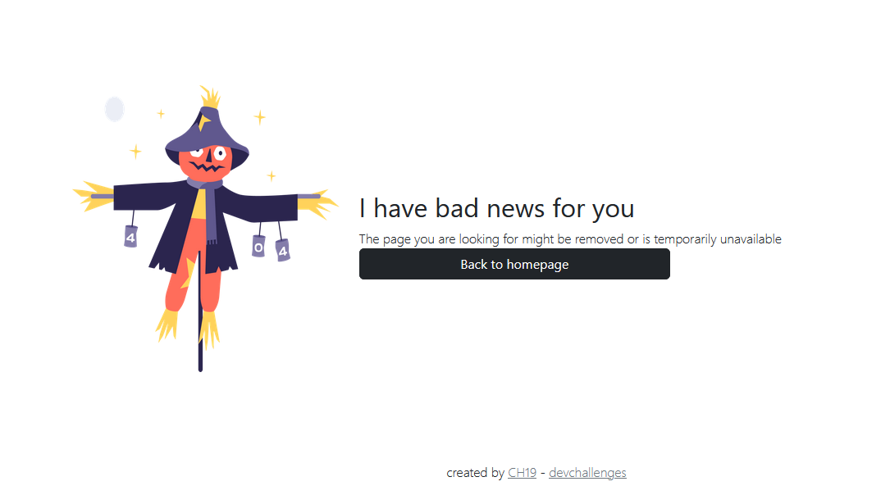
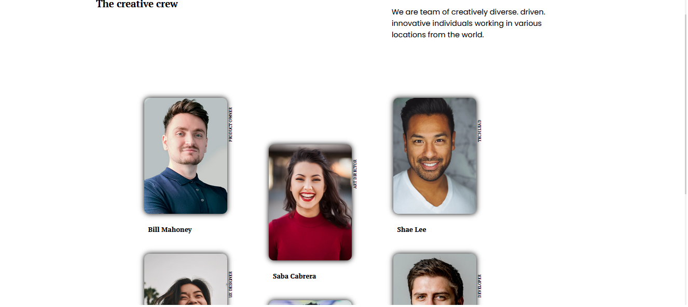

<!-- Please update value in the {}  -->

<h1 align="center">Responsive Challenges</h1>

<div align="center">
   Conjunto de soluciones a desafios responsive de  <a href="http://devchallenges.io" target="_blank">Devchallenges.io</a>.
</div>


<!-- TABLE OF CONTENTS -->

## Table of Contents

- [Table of Contents](#table-of-contents)
- [Overview](#overview)
    - [Desafio 1](#desafio-1)
    - [Desafio 2](#desafio-2)
    - [Desafio 3](#desafio-3)
    - [Desafio 4](#desafio-4)
  - [Built With](#built-with)
- [Features](#features)
- [How To Use](#how-to-use)
- [Acknowledgements](#acknowledgements)
- [Contact](#contact)

<!-- OVERVIEW -->

## Overview

Conjunto de desafios hechos para dev-challenges


#### Desafio 1



[Deploy](https://ch19.github.io/dev-challenges-responsive/404-not-found-master/idex.html)


Este primer desafio consistio en la construccion de una paginas de error 404 y en maquetarlo de forma responsive, lo hice con mis conocimientos de HTML, CSS y en este desafio en particular hay alugnos componentes de bootstrap para probarlo

#### Desafio 2



[Deploy](https://ch19.github.io/dev-challenges-responsive/my-team-page-master/index.html)

Este proyecto me permitio seguir mejorando en mis habilidades con HTML y CSS incursionando en el uso de propiedades como transform, translate, los selectores ::before y meejorar el css-grid. Además de eso mi proyecto lo combine co un poco de Javascript usando la libreria de [Color-Thief](https://lokeshdhakar.com/projects/color-thief/) para utilizar la paleta de colores al hacer hover e las cards

#### Desafio 3


[Deploy](https://ch19.github.io/dev-challenges-responsive/Interior-Consultant/interior-consultant-master/index.html)

Este proyecto es una landing page responsive de una empresa consultora de interiores utilice y agrege algunas cosas para mejorar la plantilla suministrada y hacerlo mas efectiva

#### Desafio 4


[Deploy](https://6511bb836686c84ce69ab6ec--celebrated-liger-278b00.netlify.app/)

Esta es una landing page de paginas de pastelerias para enseñar productos y como hacer recetas relacionadas cone esta indole. fue programada en typescript y con vue como framework para probar el sistema de modulos en la maquetación. Como fue mi primera experiencia combinando typescript con Vue no se sorprendan si en la creacion de componentes no hay las mejores prácticas


### Built With

<!-- This section should list any major frameworks that you built your project using. Here are a few examples.-->

- HTML, CSS and Javascript
- [Vue.js](https://vuejs.org/)
- [Typescript](https://www.typescriptlang.org/)
- [Bootstrap](https://getbootstrap.com/)

## Features

<!-- List the features of your application or follow the template. Don't share the figma file here :) -->

This application/site was created as a submission to a [DevChallenges](https://devchallenges.io/challenges) challenge. The [challenge](https://devchallenges.io/challenges/TtUjDt19eIHxNQ4n5jps) was to build an application to complete the following user stories:

- [x] User story: This is a completed user stories
- [ ] User story: This is a incompleted user stories
- [ ] User story: This is a incompleted 2nd user stories

## How To Use

To clone and run this application, you'll need [Git](https://git-scm.com) and [Node.js](https://nodejs.org/en/download/) (which comes with [npm](http://npmjs.com)) installed on your computer. From your command line:

```bash
# Clone this repository
$ git clone https://github.com/your-user-name/your-project-name

# Install dependencies
$ npm install

[Selecciona el proyecto en el que quieras trabajar]

# Run the app
$ npm run dev
```

## Acknowledgements

<!-- This section should list any articles or add-ons/plugins that helps you to complete the project. This is optional but it will help you in the future. For exmpale -->

- [ Vue + Vite + TypeScript + Setup Script: Comunicación entre componentes ](https://www.youtube.com/watch?v=lSEW2efUTEE&t=116s): Este video de fernando herrera me ayudo a comprender mejor como funciona la reactividad en vue y buenas practicas al trabajar con esta herramienta y typescript

## Contact

- GitHub [@CH19](https://github.com/CH19)
<!-- - Twitter [@your-twitter](https://{twitter.com/your-username}) -->
