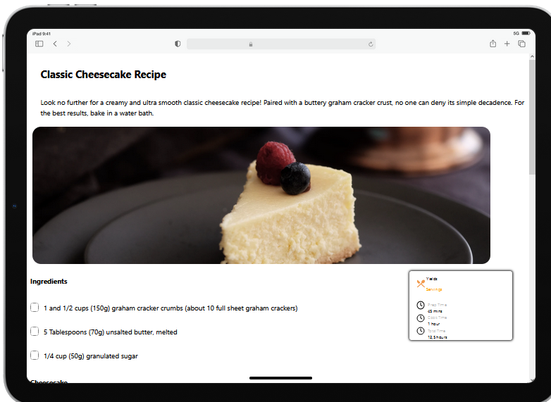

<!-- Please update value in the {}  -->

<h1 align="center">{Your project name}</h1>

<div align="center">
   Solution for a challenge from  <a href="http://devchallenges.io" target="_blank">Devchallenges.io</a>.
</div>

<div align="center">
  <h3>
    <a href="https://{your-demo-link.your-domain}">
      Demo
    </a>
    <span> | </span>
    <a href="https://{your-url-to-the-solution}">
      Solution
    </a>
    <span> | </span>
    <a href="https://{your-url-to-the-challenge}">
      Challenge
    </a>
  </h3>
</div>

<!-- TABLE OF CONTENTS -->

## Table of Contents

- [Table of Contents](#table-of-contents)
- [Overview](#overview)
  - [Built With](#built-with)
- [Features](#features)
- [How To Use](#how-to-use)
- [Acknowledgements](#acknowledgements)
- [Contact](#contact)

<!-- OVERVIEW -->

## Overview



Esta es una landing page de paginas de pastelerias para enseñar productos y como hacer recetas relacionadas cone esta indole. fue programada en typescript y con vue como framework para probar el sistema de modulos en la maquetación. Como fue mi primera experiencia combinando typescript con Vue no se sorprendan si en la creacion de componentes no hay las mejores prácticas

- La demo la pueden ver en el siguiente [link]('#')
- Mi experiencia de desarrollo fue bastante agradale y rapida en diversificar la creacion de las paginas en componentes
- En este proyecto aprendi a usar Vue con Typescript, como pasar las promps en este framework de mejor forma, la maquetacion mobile first la estoy mejorando, etc

### Built With

<!-- This section should list any major frameworks that you built your project using. Here are a few examples.-->


- [Vue.js](https://vuejs.org/)
- [Typescript](https://www.typescriptlang.org/)

## Features

<!-- List the features of your application or follow the template. Don't share the figma file here :) -->

This application/site was created as a submission to a [DevChallenges](https://devchallenges.io/challenges) challenge. The [challenge](https://devchallenges.io/challenges/TtUjDt19eIHxNQ4n5jps) was to build an application to complete the following user stories:

- [x] User story: This is a completed user stories
- [ ] User story: This is a incompleted user stories
- [ ] User story: This is a incompleted 2nd user stories

## How To Use

To clone and run this application, you'll need [Git](https://git-scm.com) and [Node.js](https://nodejs.org/en/download/) (which comes with [npm](http://npmjs.com)) installed on your computer. From your command line:

```bash
# Clone this repository
$ git clone https://github.com/your-user-name/your-project-name

# Install dependencies
$ npm install

# Run the app
$ npm run dev
```

## Acknowledgements

<!-- This section should list any articles or add-ons/plugins that helps you to complete the project. This is optional but it will help you in the future. For exmpale -->

- [ Vue + Vite + TypeScript + Setup Script: Comunicación entre componentes ](https://www.youtube.com/watch?v=lSEW2efUTEE&t=116s): Este video de fernando herrera me ayudo a comprender mejor como funciona la reactividad en vue y buenas practicas al trabajar con esta herramienta y typescript

## Contact

- GitHub [@CH19](https://github.com/CH19)
<!-- - Twitter [@your-twitter](https://{twitter.com/your-username}) -->
